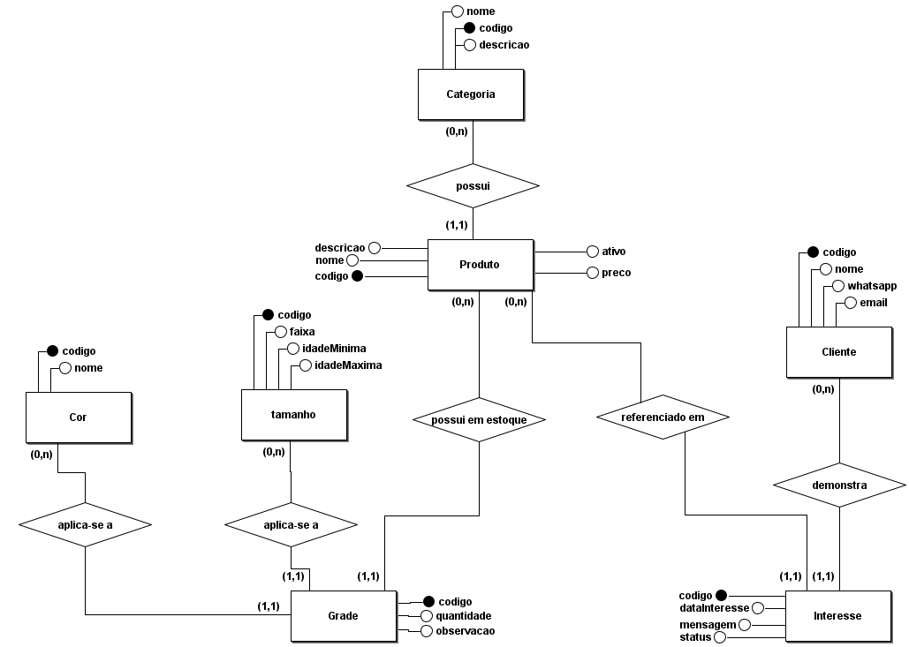

# Bebê Designs — Projeto Tico de Gente (TF03)

## Integrantes:
* [Breno Henrique Ferreira da Silva](https://github.com/Breno-Henrique-Winner )
* [Daniel Meireles Ribeiro Santos](https://github.com/Daniell099 )
* [João Victor dos Santos Angelo](https://github.com/Joao-Baby )
* [Miguel Mendes Martim](https://github.com/MiguelMartim )
* [Tiago Gabriel dos Santos Nascimento](https://github.com/TiagoGabriel12 )

---

## 1. Descrição do Domínio e do Sistema

**Tema**: Galeria Virtual "Tico de Gente" (Moda Infantil).

**O Problema**: 
A loja Tico de Gente necessita de uma vitrine digital moderna e intuitiva para expor seus produtos de moda infantil. O objetivo é permitir que os clientes visualizem as coleções, confiram as variações disponíveis e iniciem o contato para compra via WhatsApp. O sistema precisa de uma área administrativa protegida por login para garantir que apenas os gestores da loja possam atualizar o catálogo.

**Usuários do Sistema**:
*   **Clientes**: Navegam pela galeria, visualizam os produtos e utilizam o redirecionamento para o WhatsApp.
*   **Administradores (ADM)**: Gerenciam o catálogo, possuindo permissões para cadastrar e editar produtos, categorias, cores e tamanhos.

---

## 2. Modelo Conceitual

O modelo conceitual representa as entidades do domínio e suas relações lógicas.



### Explicação das Cardinalidades

*   **CATEGORIA (1,n) — possui — PRODUTO (1,1)**: Uma categoria pode agrupar vários produtos, mas cada produto pertence a apenas uma categoria.
*   **PRODUTO (0,n) — disponível em — TAMANHO (0,n)**: Um produto pode ter vários tamanhos, e um tamanho pode estar em vários produtos.
*   **PRODUTO (0,n) — disponível em — COR (0,n)**: Um produto pode ter várias cores, e uma cor pode estar em vários produtos.

---

## 3. Modelo Lógico

Abaixo, a representação do esquema do banco de dados (Mermaid), refletindo o arquivo `schema.prisma`.

```mermaid
erDiagram
    usuarios ||--o{ produtos : "gerencia (ADM)"
    categorias ||--o{ produtos : "possui"
    produtos }o--o{ tamanhos : "disponível em"
    produtos }o--o{ cores : "disponível em"

    usuarios {
        string id PK
        string email UK
        string senha
        string nome
        string role
    }

    categorias {
        string id PK
        string nome
        string descricao
    }

    produtos {
        string id PK
        string nome
        string descricao
        float preco
        boolean ativo
        string imageUrl
        string whatsappLink
    }

    tamanhos {
        string id PK
        string faixa
    }

    cores {
        string id PK
        string nome
    }